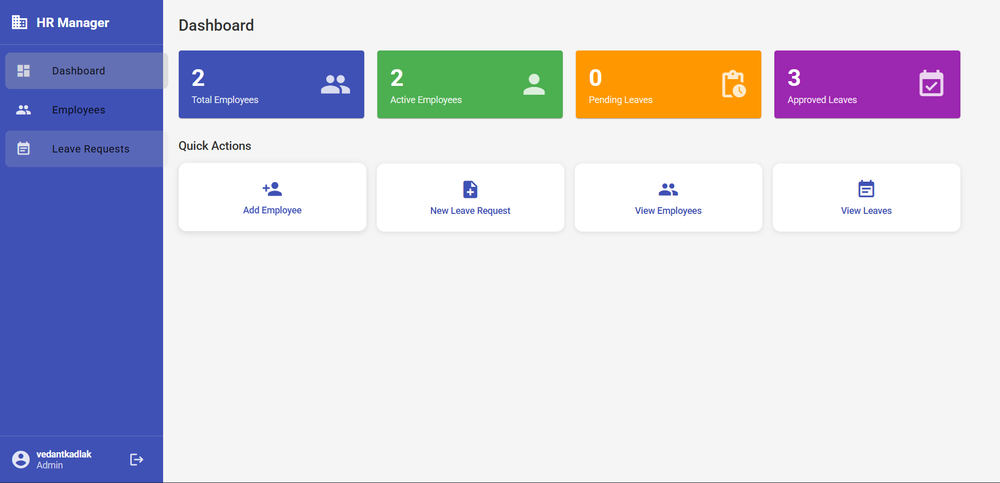
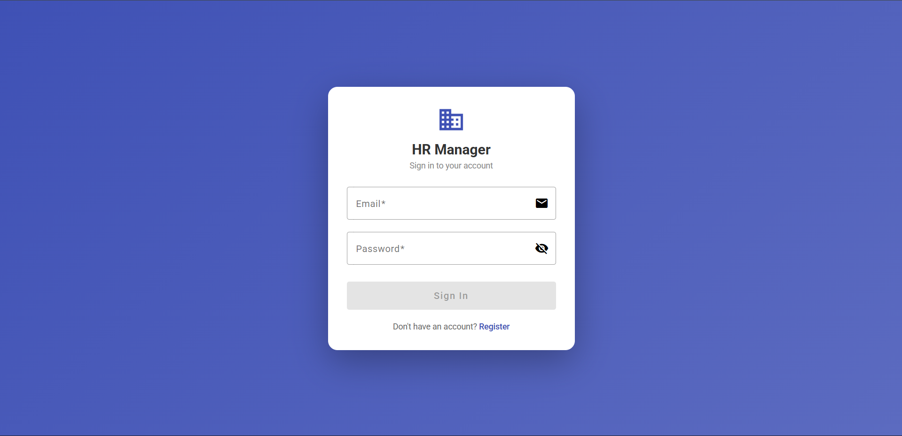
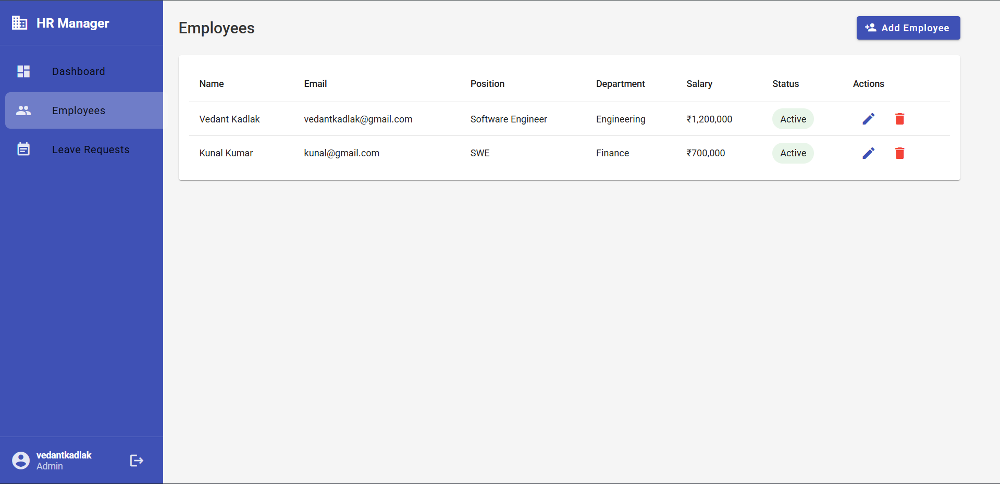
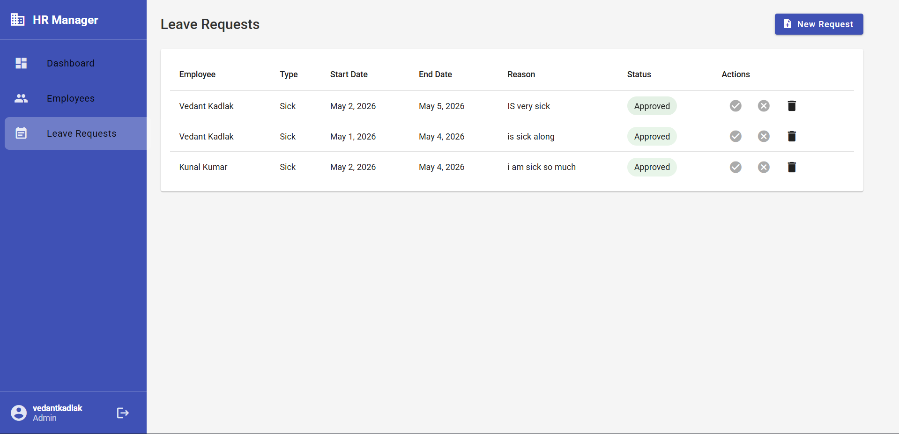

# HR Management System

A full-stack HR Management web application built with ASP.NET Core (.NET 10) and Angular 17, featuring employee management, leave tracking, JWT authentication, and a real-time dashboard.



---

## Features

- **Authentication** — Register, Login, Logout with JWT tokens
- **Employee Management** — Full CRUD (Create, Read, Update, Delete)
- **Department Management** — Organize employees by departments
- **Leave Requests** — Apply, approve, and reject leave applications
- **Dashboard** — Live stats (Total Employees, Active, Pending Leaves, Approved Leaves)
- **Quick Actions** — Fast navigation to key HR operations
- **Route Guards** — Protected routes for authenticated users only
- **Role-Based Access** — Admin, HR, and Employee roles

---

## Tech Stack

### Backend

| Technology                      | Purpose               |
| ------------------------------- | --------------------- |
| ASP.NET Core Web API (.NET 10)  | REST API              |
| Entity Framework Core           | ORM + Migrations      |
| SQL Server 2022                 | Database              |
| ASP.NET Core Identity           | User management       |
| JWT Bearer Authentication       | Token-based auth      |
| Swagger / OpenAPI               | API documentation     |

### Frontend

| Technology         | Purpose                  |
| ------------------ | ------------------------ |
| Angular 17         | Frontend framework       |
| Angular Material   | UI component library     |
| TypeScript         | Language                 |
| Reactive Forms     | Form handling            |
| HTTP Interceptors  | Auto JWT attachment      |
| Route Guards       | Protected navigation     |
| RxJS               | Async data streams       |
| SCSS               | Styling                  |

---

## Architecture

Clean Architecture pattern with 4 layers:

├── HRManagement.Domain/ # Entities: Employee, Department, LeaveRequest
├── HRManagement.Application/ # DTOs, Interfaces, Business Services
├── HRManagement.Infrastructure/ # AppDbContext, EF Core, Migrations
├── HRManagement.API/ # Controllers, Program.cs, Auth setup
└── HRManagement.Client/ # Angular 17 frontend


---

## Getting Started

### Prerequisites

- [.NET 10 SDK](https://dotnet.microsoft.com/download)
- [Node.js 18+](https://nodejs.org/)
- [SQL Server 2022](https://www.microsoft.com/en-us/sql-server)
- [Angular CLI](https://angular.io/cli) — `npm install -g @angular/cli`

---

### Backend Setup

**1. Clone the repository**

```bash
git clone https://github.com/VedantKadlaKK/hr-management-system.git
cd hr-management-system
```

**2. Update connection string in `HRManagement.API/appsettings.json`**

```json
"ConnectionStrings": {
  "DefaultConnection": "Server=.\\SQLEXPRESS;Database=HRManagementDB;Trusted_Connection=True;TrustServerCertificate=True"
}
```

**3. Apply database migrations**

```bash
dotnet ef database update --project HRManagement.Infrastructure --startup-project HRManagement.API
```

**4. Run the API**

```bash
dotnet run --project HRManagement.API
```

- API runs at: `http://localhost:5019`
- Swagger UI: `http://localhost:5019/swagger`

---

### Frontend Setup

**1. Navigate to client folder**

```bash
cd HRManagement.Client
```

**2. Install dependencies**

```bash
npm install
```

**3. Run Angular app**

```bash
ng serve
```

App runs at: `http://localhost:4200`

---

## Screenshots

| Login | Dashboard |
| ----- | --------- |
|  |  |

| Employees | Leave Requests |
| --------- | -------------- |
|  |  |

---

## Default Test Credentials

After registering via `/register`:

- **Role options:** `Admin`, `HR`, `Employee`
- **Password minimum:** 6 characters

---

## API Endpoints

### Auth

| Method | Endpoint              | Description           |
| ------ | --------------------- | --------------------- |
| POST   | `/api/auth/register`  | Register new user     |
| POST   | `/api/auth/login`     | Login + get JWT token |

### Employees

| Method | Endpoint               | Description          |
| ------ | ---------------------- | -------------------- |
| GET    | `/api/employees`       | Get all employees    |
| GET    | `/api/employees/{id}`  | Get employee by ID   |
| POST   | `/api/employees`       | Create employee      |
| PUT    | `/api/employees/{id}`  | Update employee      |
| DELETE | `/api/employees/{id}`  | Delete employee      |

### Leave Requests

| Method | Endpoint                    | Description              |
| ------ | --------------------------- | ------------------------ |
| GET    | `/api/leaverequests`        | Get all leave requests   |
| POST   | `/api/leaverequests`        | Create leave request     |
| PUT    | `/api/leaverequests/{id}`   | Update leave request     |
| DELETE | `/api/leaverequests/{id}`   | Delete leave request     |

---

## Roadmap

- [ ] Role-based UI (Admin vs HR vs Employee views)
- [ ] Dashboard charts with Chart.js
- [ ] Export to Excel / PDF
- [ ] Search, filter, and pagination
- [ ] Deploy to Azure

---

## Author

**Vedant Kadlak**

- GitHub: [@VedantKadlaKK](https://github.com/VedantKadlaKK)
- LinkedIn: [Vedant Kadlak](https://www.linkedin.com/in/vedant-kadlak-b6047128b/)

---

## License

This project is licensed under the [MIT License](LICENSE).